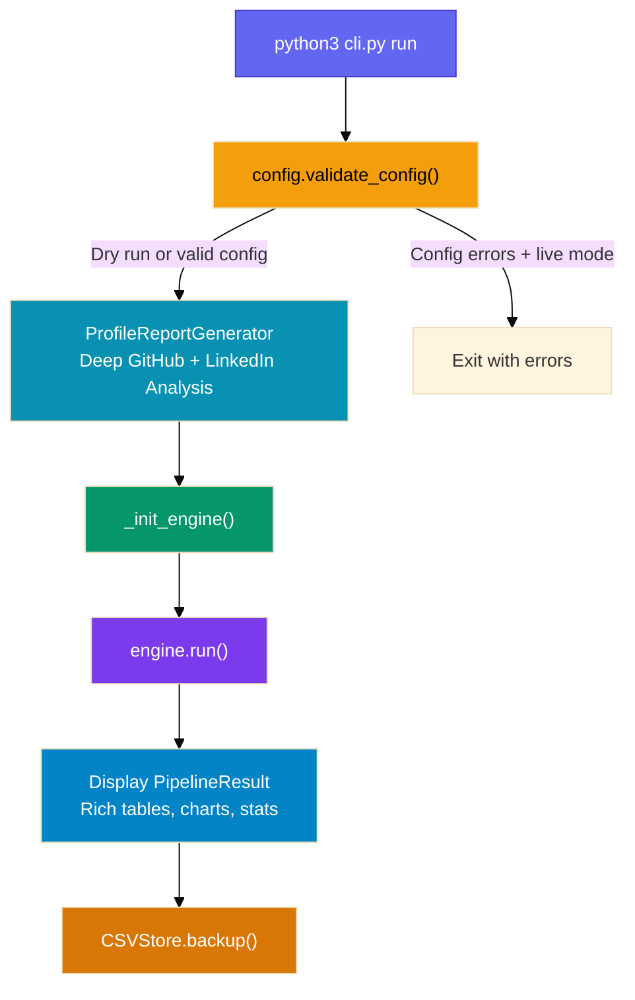
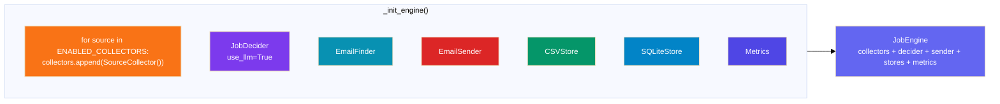
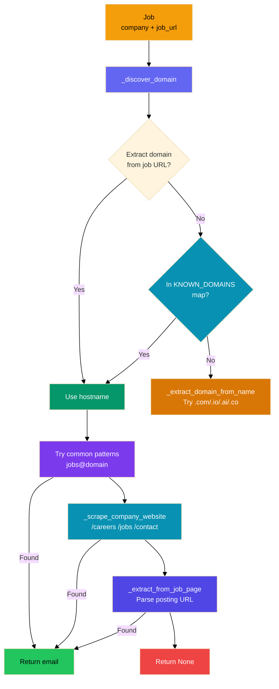
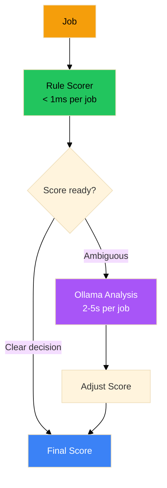
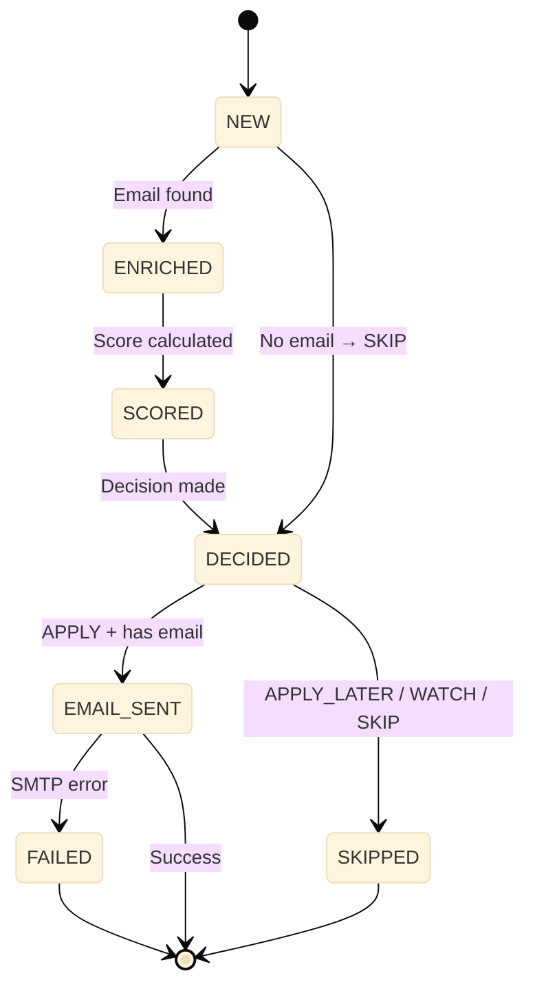
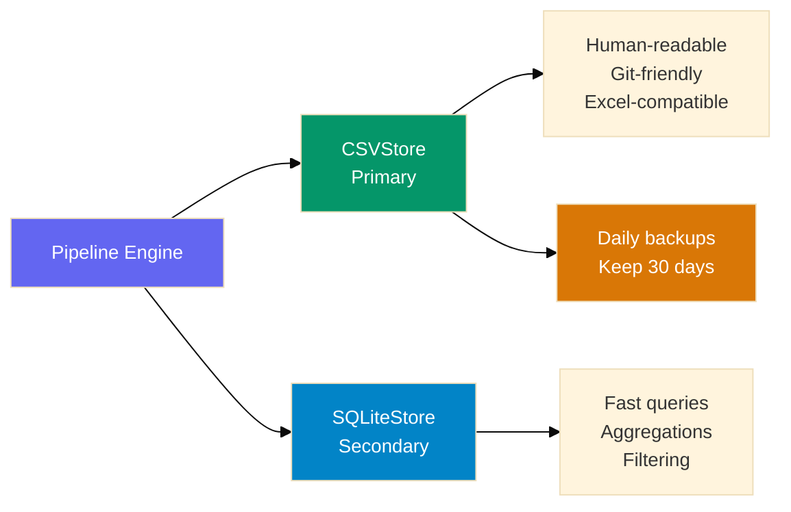
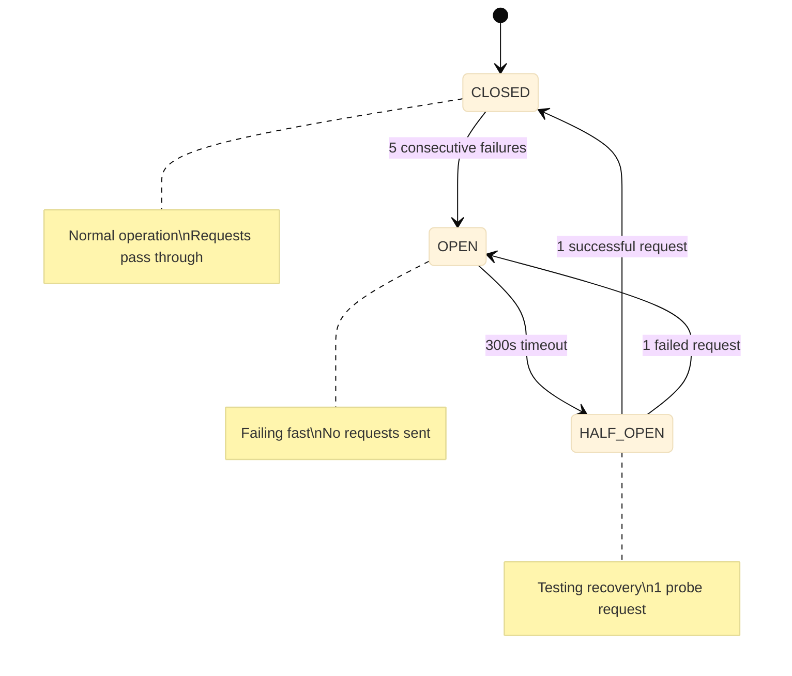
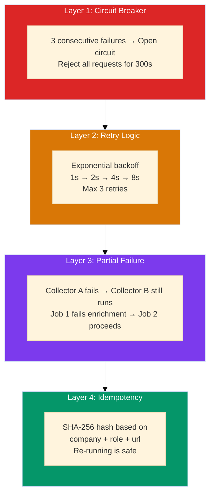
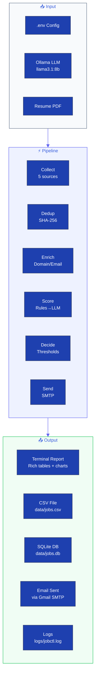

# 🏗️ System Architecture — Job Intelligence OS

> **How the system works from `python3 cli.py run` to pipeline completion.**

---

## Table of Contents

1. [Entry Point: CLI](#1-entry-point-cli)
2. [Configuration & Initialization](#2-configuration--initialization)
3. [Profile Analysis](#3-profile-analysis)
4. [Pipeline Engine](#4-pipeline-engine)
5. [Collection Phase](#5-collection-phase)
6. [Deduplication Phase](#6-deduplication-phase)
7. [Enrichment Phase](#7-enrichment-phase)
8. [Scoring Phase](#8-scoring-phase)
9. [Decision Phase](#9-decision-phase)
10. [Outreach Phase](#10-outreach-phase)
11. [Storage Phase](#11-storage-phase)
12. [Observability](#12-observability)
13. [Error Handling & Reliability](#13-error-handling--reliability)
14. [CLI Commands Reference](#14-cli-commands-reference)

---

## 1. Entry Point: CLI

**File:** `cli.py`

The system is invoked via `python3 cli.py run`. The CLI is built with **Typer** and provides these commands:

| Command | Description |
|---------|-------------|
| `run` | Full pipeline: collect → enrich → score → decide → send → store |
| `status` | Show system health and 7-day activity summary |
| `stats` | Detailed statistics with time period filtering |
| `audit` | Browse job decisions with filtering |
| `retry` | Re-process failed jobs |
| `config-check` | Validate `.env` configuration |
| `upload-resume` | Upload a PDF resume |

### Execution Flow



### Key Code Path

```python
# cli.py:81-186
@app.command()
def run(sources="all", dry_run=False):
    setup_logging()
    errors = config.validate_config()       # 1. Validate .env
    if errors and not dry_run:              # 2. Exit if bad config (live mode)
        raise typer.Exit(1)

    profile_gen = ProfileReportGenerator()  # 3. Deep profile analysis
    profile_report = profile_gen.generate_report()
    profile_gen.save_report(profile_report)

    engine = _init_engine(dry_run=dry_run)  # 4. Wire up components
    result = engine.run(sources=source_list) # 5. Execute pipeline

    _display_detailed_job_report(result.all_jobs)  # 6. Rich terminal output
    csv_store.backup()                       # 7. Daily backup
```

---

## 2. Configuration & Initialization

**File:** `config.py`

The system loads configuration from a `.env` file using `python-dotenv`. Key configuration groups:

### Collector Configuration

```python
# Which sources to scrape (comma-separated)
ENABLED_COLLECTORS = ["linkedin", "ycombinator", "angellist", "wellfound"]
```

### Job Preferences

```python
TARGET_ROLES = ["AI Engineer"]
YOUR_SKILLS = ["Python"]
PREFERRED_LOCATIONS = ["San Francisco", "Remote"]
```

### Thresholds

```python
APPLY_THRESHOLD = 75     # Score >= 75 → APPLY
APPLY_LATER_THRESHOLD = 50  # Score >= 50 → APPLY_LATER
WATCH_THRESHOLD = 30     # Score >= 30 → WATCH
```

### Engine Initialization



### Data Flow in Engine

```python
# core/engine.py
class JobEngine:
    def __init__(self, collectors, decider, email_finder, email_sender,
                 csv_store, sqlite_store, metrics, dry_run=False):
        self.collectors = collectors    # List[BaseCollector]
        self.decider = decider          # JobDecider
        self.email_finder = email_finder  # EmailFinder
        self.email_sender = email_sender  # EmailSender
        self.csv_store = csv_store      # CSVStore
        self.sqlite_store = sqlite_store  # SQLiteStore
        self.metrics = metrics          # Metrics
        self.dry_run = dry_run          # bool
```

---

## 3. Profile Analysis

**File:** `enrichment/profile_report.py`

Before the pipeline runs, the system performs a deep analysis of the user's online presence:

### GitHub Analysis

1. Fetches ALL repositories via GitHub REST API (`/users/{username}/repos`)
2. Extracts: name, description, stars, forks, language, topics
3. Generates AI insights using Ollama (analyzes top 10 repos)
4. Saves results to `enrichment/github_analysis_{date}.csv`

### LinkedIn Analysis

1. Launches Playwright (headless Chromium) to scrape the public profile
2. Extracts: name, headline, activity posts
3. Scans posts for **hiring keywords** (e.g., "hiring", "job opening", "we are looking for")
4. If hiring opportunities detected → auto-sends email alert
5. Saves results to `enrichment/linkedin_analysis_{date}.csv`

### Profile Report Output

Saved to `data/profile_report_{timestamp}.json` containing:

```json
{
  "profile": {"name", "title", "github", "linkedin"},
  "github_analysis": {"all_repos": [...], "languages_breakdown": {...}},
  "linkedin_analysis": {"posts": [...], "hiring_opportunities": [...]},
  "projects": [...],
  "skills": [...],
  "target_roles": [...]
}
```

---

## 4. Pipeline Engine

**File:** `core/engine.py`

The `engine.run()` method orchestrates the entire pipeline through these phases:


### PipelineResult

After execution, the engine returns a `PipelineResult`:

```python
@dataclass
class PipelineResult:
    jobs_collected: int       # Total jobs from all sources
    jobs_deduplicated: int    # New jobs after dedup
    jobs_enriched: int        # Jobs with emails found
    jobs_scored: int          # Jobs that got a score
    decisions_made: dict      # {Decision.APPLY: 5, Decision.SKIP: 10}
    emails_sent: int          # Successful emails
    duration_seconds: float   # Pipeline wall time
    source_stats: dict        # {linkedin: 164, ycombinator: 0}
    all_jobs: list            # All Job objects for reporting
```

---

## 5. Collection Phase

**File:** `collectors/`

### Architecture

All collectors inherit from `BaseCollector`:

```python
class BaseCollector(ABC):
    def collect(self) -> List[Job]:
        with circuit_breaker:
            return self._collect_impl()
```

### Collector: LinkedIn

**File:** `collectors/linkedin.py`

- HTTP scraper (no Playwright for job search)
- Searches LinkedIn Jobs with keywords + location
- Handles pagination (up to 5 pages)
- Parses HTML with BeautifulSoup
- **Rate limit handling:** 429 responses trigger retry with backoff

```python
class LinkedInCollector(BaseCollector):
    def _collect_impl(self):
        for keyword in config.TARGET_ROLES:
            for location in config.PREFERRED_LOCATIONS:
                for page in range(1, 6):
                    jobs = self._scrape_page(keyword, location, page)
                    all_jobs.extend(jobs)
```

### Collector: Y Combinator

**File:** `collectors/ycombinator.py`

- Scrapes `https://www.workatastartup.com/jobs`
- Parses JSON API responses
- Filters by target roles

### Collector: Wellfound (AngelList)

**File:** `collectors/wellfound.py`

- HTTP scraper
- May receive 403 errors (anti-bot protection)
- Falls back gracefully (circuit breaker opens)

### Collector: GitHub

**File:** `collectors/github.py`

- Uses GitHub REST API v3
- Searches for: "hiring" in README, GitHub Issues with job tags
- 60 req/hr without token, 5000 req/hr with `GITHUB_TOKEN`

### Collector: Naukri

**File:** `collectors/naukri.py`

- Scrapes India's largest job portal
- HTML parsing with BeautifulSoup

### Collection Error Handling

```python
# One source failing does NOT crash the pipeline:
try:
    jobs = collector.collect()
except Exception as e:
    logger.error(f"{name} failed: {e}")
    collector.circuit_breaker.record_failure()
    continue  # Move to next source
```

---

## 6. Deduplication Phase

**File:** `core/engine.py` (inline in `run()`)

### How It Works

1. Each job generates a deterministic `job_id` via SHA-256 hash
2. Existing job IDs are loaded from CSV
3. New jobs are filtered against existing IDs

```python
def generate_id(self) -> str:
    content = f"{self.company}|{self.role}|{self.job_url}"
    return hashlib.sha256(content.encode()).hexdigest()[:16]

# In engine:
existing_ids = set(csv_store.get_existing_job_ids())
new_jobs = [job for job in all_jobs if job.job_id not in existing_ids]
```

### Why SHA-256?

| Property | Benefit |
|----------|---------|
| Deterministic | Same input → same ID every time |
| Collision-resistant | Virtually impossible to hash two different jobs same |
| Fast | Microseconds per hash |
| No DB needed | Just compare against a set of strings |

---

## 7. Enrichment Phase

**File:** `enrichment/email_finder.py`

### Email Discovery Strategy

The `EmailFinder` uses a multi-strategy approach:



### Domain Discovery

```python
def _discover_domain(self, job: Job) -> Optional[str]:
    # Strategy 1: Extract from job URL (e.g., careers.sievecorp.com)
    domain = self._extract_domain_from_url(job.job_url)
    if domain:
        return domain

    # Strategy 2: Known domain mapping
    if company_key in self.KNOWN_DOMAINS:
        return self.KNOWN_DOMAINS[company_key]

    # Strategy 3: Generate from company name
    return self._extract_domain_from_name(job.company)
```

### Email Verification

The system does NOT send verification pings. It relies on:
- **Domain existence** (DNS resolution check)
- **Known domain mapping** (50+ curated companies)
- **Regex extraction** from career pages

---

## 8. Scoring Phase

**File:** `intelligence/`

### Two-Stage Scoring



### Rule-Based Scoring

**File:** `intelligence/scorer.py`

```python
score = 0

# 1. Role Match (30 points)
if any(target_role.lower() in job.role.lower() 
       for target_role in config.TARGET_ROLES):
    score += 30

# 2. Skills Match (20 points)
matched_skills = [s for s in config.YOUR_SKILLS 
                  if s.lower() in job.description.lower()]
score += min(20, len(matched_skills) * 4)

# 3. Location (15 points)
if any(loc.lower() in job.location.lower() 
       for loc in config.PREFERRED_LOCATIONS):
    score += 15

# 4. Company Stage (10 points)
if job.company_stage in config.PREFERRED_COMPANY_STAGES:
    score += 10

# 5. Recency (15 points)
if job.posted_date and (datetime.utcnow() - job.posted_date).days <= 7:
    score += 15

# 6. Salary Check (10 points)
if job.salary_min and job.salary_min >= config.MIN_SALARY:
    score += 10
```

### LLM Analysis

**File:** `intelligence/decider.py`

When a job score falls in an ambiguous range, the system invokes Ollama:

```python
class JobDecider:
    def score_job(self, job: Job) -> tuple[int, str]:
        rule_score = self.rules_scorer.score(job)

        if self.needs_llm_analysis(rule_score):
            llm_result = self.llm.analyze(job)
            final_score = self.adjust_score(rule_score, llm_result)
            reason = llm_result.get("reasoning", "")
        else:
            final_score = rule_score
            reason = self.rules_scorer.get_reason(job)

        return final_score, reason
```

---

## 9. Decision Phase

**File:** `intelligence/decider.py`

### Decision Thresholds

```python
if score >= config.APPLY_THRESHOLD:           # >= 75
    return Decision.APPLY
elif score >= config.APPLY_LATER_THRESHOLD:   # >= 50
    return Decision.APPLY_LATER
elif score >= config.WATCH_THRESHOLD:         # >= 30
    return Decision.WATCH
else:                                          # < 30
    return Decision.SKIP
```

### Decision Pipeline



### Reasoning String

Every decision includes a human-readable reason:

```
"Role 'AI Engineer' matches target; 3 skills matched (Python, LangChain, RAG);
Located in San Francisco; Startup stage preferred; Posted 2 days ago"
```

---

## 10. Outreach Phase

**File:** `outreach/`

### Email Sender

**File:** `outreach/sender.py`

```python
class EmailSender:
    def send_job_emails(self, jobs: List[Job]) -> int:
        sent = 0
        for job in jobs:
            if job.decision != Decision.APPLY:
                continue
            if not job.email:
                continue
            if not self._rate_limit_ok():
                break

            if self.dry_run:
                logger.info(f"[DRY RUN] Would send to {job.email}")
                continue

            success = self._send(job)
            if success:
                sent += 1
                time.sleep(EMAIL_DELAY_SECONDS)  # Human-like pacing
```

### Rate Limiting

| Limit | Value | Reason |
|-------|-------|--------|
| Per hour | 5 emails | Gmail's sending threshold |
| Per day | 20 emails | Avoid spam flagging |
| Delay between | 60 seconds | Appear human |

### Email Composer

**File:** `outreach/composer.py`

Generates personalized HTML emails:

- **Header:** Gradient-styled with company name and role
- **Body:** AI-generated paragraph explaining why the user is a good fit
- **CTA:** "Apply Now" button linking to the job URL
- **Footer:** Signature with links to GitHub, LinkedIn, portfolio

### SMTP Configuration

Connects to any SMTP server (default: Gmail):

```python
with smtplib.SMTP(config.SMTP_HOST, config.SMTP_PORT) as server:
    server.starttls()
    server.login(config.SMTP_USERNAME, config.SMTP_PASSWORD)
    server.send_message(msg)
```

---

## 11. Storage Phase

**File:** `storage/`

### Dual Storage Strategy



### CSVStore

**File:** `storage/csv_store.py`

- **Primary source of truth**
- Append-only (never modifies existing rows)
- Each row = one job record
- Supports: search, dedup lookup, stats aggregation

### SQLiteStore

**File:** `storage/sqlite_store.py`

- **Secondary query store**
- Supports: filtering by decision, date, source
- Used by: `status`, `stats`, `audit` CLI commands

### Backup Mechanism

```python
def backup(self):
    timestamp = datetime.now().strftime("%Y%m%d_%H%M%S")
    backup_path = BACKUP_DIR / f"jobs_{timestamp}.csv"
    shutil.copy2(CSV_FILE, backup_path)
    self._cleanup_old_backups()  # Keep last 30 days
```

---

## 12. Observability

**File:** `observability/`

### Logging

**File:** `observability/logger.py`

```python
# Structured logging with levels:
- DEBUG:   Detailed debugging information
- INFO:    Pipeline milestones (started, completed)
- WARNING: Expected failures (429, no email found)
- ERROR:   Unexpected failures (network down, crash)
```

### Metrics

**File:** `observability/metrics.py`

Tracks pipeline performance counters:

```python
class Metrics:
    jobs_collected: int
    emails_sent: int
    errors: int
    source_stats: dict    # Per-source job counts
    decision_stats: dict  # Per-decision counts
    duration: float       # Wall clock time
```

### Circuit Breaker

**File:** `observability/circuit_breaker.py`



```python
class CircuitBreaker:
    CLOSED = "CLOSED"      # Normal — requests pass
    OPEN = "OPEN"          # Failing — requests rejected
    HALF_OPEN = "HALF_OPEN"  # Testing — one probe request

    def call(self, fn):
        if self.state == self.OPEN:
            if self._cooldown_expired():
                self.state = self.HALF_OPEN
            else:
                raise CircuitBreakerOpen()

        try:
            result = fn()
            if self.state == self.HALF_OPEN:
                self.state = self.CLOSED  # Recovery successful
            self.failures = 0
            return result
        except Exception:
            self.failures += 1
            if self.failures >= 5:
                self.state = self.OPEN
            raise
```

---

## 13. Error Handling & Reliability

### Multi-Layer Defense



### What Happens When...

| Scenario | System Behavior |
|----------|----------------|
| LinkedIn returns 429 | Retry 3x with backoff, then circuit breaker opens |
| Wellfound returns 403 | Circuit breaker opens, pipeline continues |
| GitHub API is down | Other collectors still run |
| Email bounces | Logged, job marked FAILED, no retry |
| CSV file locked | Error logged, process exits cleanly |
| Ollama not running | LLM analysis skipped, rule-based only |
| Missing .env field | Config validation catches it early |

---

## 14. CLI Commands Reference

### `python3 cli.py run`

Full pipeline execution.

| Flag | Default | Description |
|------|---------|-------------|
| `--sources` / `-s` | `all` | Comma-separated sources to enable |
| `--dry-run` | `False` | Run without sending emails |

### `python3 cli.py status`

7-day system health snapshot. Shows:
- Total jobs collected
- Emails sent / total
- Decision breakdown
- Source breakdown

### `python3 cli.py stats`

Detailed statistics with time filtering.

| Flag | Default | Description |
|------|---------|-------------|
| `--last` / `-l` | `30d` | Time period (e.g., `7d`, `30d`) |

### `python3 cli.py audit`

Browse job decisions.

| Flag | Default | Description |
|------|---------|-------------|
| `--decision` / `-d` | `None` | Filter: `APPLY`, `APPLY_LATER`, `WATCH`, `SKIP` |
| `--limit` / `-n` | `20` | Max jobs to show |

### `python3 cli.py retry`

Re-process failed jobs.

| Flag | Default | Description |
|------|---------|-------------|
| `--failed` | `False` | Must be set to retry |
| `--limit` / `-n` | `10` | Max jobs to retry |

### `python3 cli.py config-check`

Validates `.env` configuration. Exits with code 1 if invalid.

### `python3 cli.py upload-resume <path>`

Uploads a PDF resume to the system.

| Argument | Description |
|----------|-------------|
| `resume_path` | Path to your PDF resume file |

---

## Data Flow Summary



---

## Key Design Decisions

| Decision | Rationale |
|----------|-----------|
| CSV as primary store | Human-readable, git-friendly, no DB setup |
| Rules before LLM | 80% of jobs decided in <1ms, zero API cost |
| Local Ollama | No API costs, privacy, works offline |
| SHA-256 dedup | Deterministic, collision-free, fast |
| Circuit breakers | Prevent cascade failures from flaky sources |
| Partial failures | One broken source ≠ broken pipeline |
| Rate limited email | Stay under spam thresholds, appear human |
| Dry-run mode | Safe testing without side effects |

---

## Production Requirements

| Resource | Minimum | Recommended |
|----------|---------|-------------|
| RAM | 4 GB | 8 GB (for Ollama) |
| Disk | 1 GB | 10 GB (logs + backups) |
| CPU | 2 cores | 4 cores |
| Ollama | llama3.1:8b | Any 7B+ model |
| Python | 3.11 | 3.12 |
| Network | Internet | Broadband |

---

*For setup instructions, see [README.md](README.md).*  
*For contributing guidelines, see [CONTRIBUTING.md](CONTRIBUTING.md).*