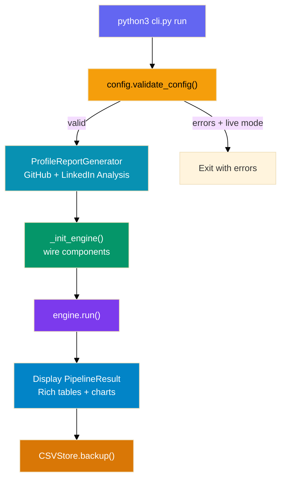
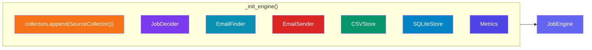
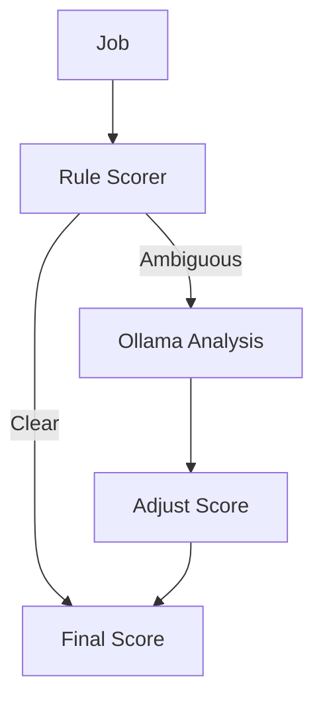
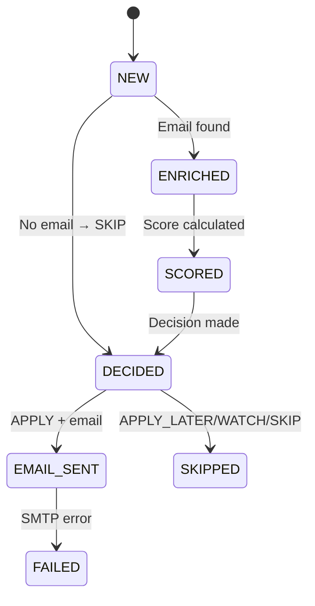
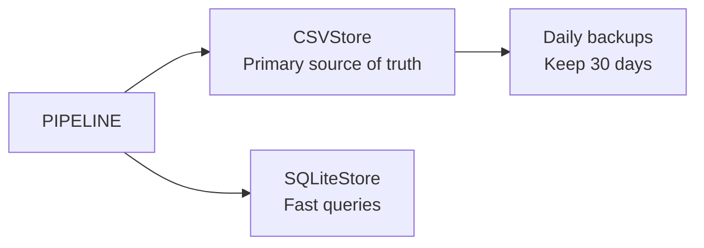
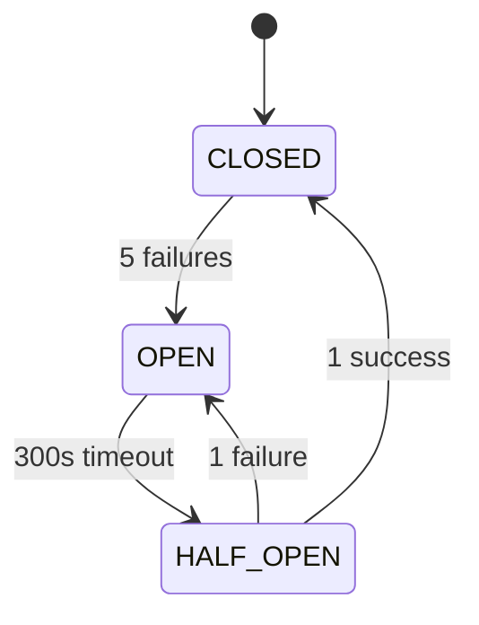

# 🏗️ System Architecture — Job Intelligence OS

> **How the system works from `python3 cli.py run` to pipeline completion.**

---

## 📑 Architecture Tabs

<details open>
<summary><strong>⚙️ 1. Entry Point — CLI</strong></summary>

The system is invoked via `python3 cli.py run`. Built with **Typer**.

| Command | Description |
|---------|-------------|
| `run` | Full pipeline: collect → enrich → score → decide → send → store |
| `status` | Show system health and 7-day activity summary |
| `stats` | Detailed statistics with time period filtering |
| `audit` | Browse job decisions with filtering |
| `retry` | Re-process failed jobs |
| `config-check` | Validate `.env` configuration |
| `upload-resume` | Upload a PDF resume |

### Execution Flow



### Key Code

```python
# cli.py:81-186
@app.command()
def run(sources="all", dry_run=False):
    setup_logging()
    errors = config.validate_config()          # 1. Validate .env
    if errors and not dry_run:
        raise typer.Exit(1)

    profile_gen = ProfileReportGenerator()      # 2. Profile analysis
    profile_report = profile_gen.generate_report()
    profile_gen.save_report(profile_report)

    engine = _init_engine(dry_run=dry_run)      # 3. Wire components
    result = engine.run(sources=source_list)    # 4. Execute pipeline

    _display_detailed_job_report(result.all_jobs)  # 5. Terminal output
    csv_store.backup()                          # 6. Daily backup
```

</details>

---

<details>
<summary><strong>🔧 2. Configuration & Initialization</strong></summary>

Loaded from `.env` via `python-dotenv`. Key groups:

```python
# Which sources to scrape
ENABLED_COLLECTORS = ["linkedin", "ycombinator", "angellist", "wellfound"]

# Job preferences
TARGET_ROLES = ["AI Engineer"]
YOUR_SKILLS = ["Python"]

# Decision thresholds
APPLY_THRESHOLD = 75     # Score >= 75 → APPLY
APPLY_LATER_THRESHOLD = 50
WATCH_THRESHOLD = 30
```

### Engine Initialization



```python
class JobEngine:
    def __init__(self, collectors, decider, email_finder, email_sender,
                 csv_store, sqlite_store, metrics, dry_run=False):
        self.collectors = collectors     # List[BaseCollector]
        self.decider = decider           # JobDecider
        self.email_finder = email_finder # EmailFinder
        self.email_sender = email_sender # EmailSender
        self.csv_store = csv_store       # CSVStore
        self.sqlite_store = sqlite_store # SQLiteStore
        self.metrics = metrics           # Metrics
        self.dry_run = dry_run           # bool
```

</details>

---

<details>
<summary><strong>📊 3. Profile Analysis</strong></summary>

Before the pipeline, the system analyzes your online presence.

### GitHub Analysis

Fetches ALL repos via `GET /users/{username}/repos`, extracts stars, forks, language, topics, generates AI insights via Ollama. Saved to `enrichment/github_analysis_{date}.csv`.

### LinkedIn Analysis

Launches Playwright headless Chromium, scrapes public profile, scans posts for hiring keywords ("hiring", "we are looking for", etc.). Auto-sends email alert if opportunities found.

### Output

```json
{
  "profile": {"name": "Vicky Kumar", "github": "...", "linkedin": "..."},
  "github_analysis": {"all_repos": [...], "languages_breakdown": {...}},
  "linkedin_analysis": {"posts": [...], "hiring_opportunities": [...]}
}
```

</details>

---

<details>
<summary><strong>⚡ 4. Pipeline Engine</strong></summary>

`engine.run()` orchestrates 7 phases:


### PipelineResult

```python
@dataclass
class PipelineResult:
    jobs_collected: int       # Total from all sources
    jobs_deduplicated: int    # New after dedup
    jobs_enriched: int        # With emails found
    jobs_scored: int          # With scores assigned
    decisions_made: dict      # {Decision.APPLY: 5, Decision.SKIP: 10}
    emails_sent: int          # Successful sends
    duration_seconds: float   # Wall time
    source_stats: dict        # {linkedin: 164, ycombinator: 0}
    all_jobs: list            # All Job objects
```

</details>

---

<details>
<summary><strong>🌐 5. Collection Phase</strong></summary>

All collectors inherit from `BaseCollector`:

```python
class BaseCollector(ABC):
    def collect(self) -> List[Job]:
        with circuit_breaker:
            return self._collect_impl()
```

| Collector | Method | Notes |
|-----------|--------|-------|
| **LinkedIn** | HTTP scraper + BS4 | 429 retry w/ backoff, 5 pages |
| **Y Combinator** | JSON API | workatastartup.com |
| **Wellfound** | HTTP scraper | May get 403, circuit breaker opens |
| **GitHub** | REST API v3 | 60 req/hr (unauthed), 5k req/hr (token) |
| **Naukri** | HTTP scraper | BS4 parsing |

### Error Isolation

```python
try:
    jobs = collector.collect()
except Exception as e:
    logger.error(f"{name} failed: {e}")
    collector.circuit_breaker.record_failure()
    continue  # Other sources still run
```

</details>

---

<details>
<summary><strong>🆔 6. Deduplication Phase</strong></summary>

SHA-256 hash of `company + role + url`:

```python
def generate_id(self) -> str:
    content = f"{self.company}|{self.role}|{self.job_url}"
    return hashlib.sha256(content.encode()).hexdigest()[:16]

# In engine:
existing_ids = set(csv_store.get_existing_job_ids())
new_jobs = [j for j in all_jobs if j.job_id not in existing_ids]
```

| Property | Benefit |
|----------|---------|
| Deterministic | Same input → same ID |
| Collision-resistant | No false dedups |
| Fast | Microseconds per hash |

</details>

---

<details>
<summary><strong>📧 7. Enrichment — Email Finder</strong></summary>

Multi-strategy email discovery:

```mermaid
flowchart TD
    JOB[Job] --> DISCOVER[_discover_domain]
    DISCOVER --> URL{from job URL?}
    URL -->|Yes| DOMAIN[Use hostname]
    URL -->|No| KNOWN{KNOWN_DOMAINS?}
    KNOWN -->|Yes| DOMAIN
    KNOWN -->|No| NAME[name → domain]
    DOMAIN --> PATTERNS[jobs@domain]
    PATTERNS -->|found| RETURN[✓]
    PATTERNS --> SCRAPE[/careers /jobs /contact]
    SCRAPE -->|found| RETURN
    SCRAPE --> JOBPAGE[parse job posting]
    JOBPAGE -->|found| RETURN
    JOBPAGE --> FAIL[None]
```

### Domain Discovery

```python
def _discover_domain(self, job: Job) -> Optional[str]:
    # 1. Extract from job URL (e.g., careers.sievecorp.com)
    domain = self._extract_domain_from_url(job.job_url)
    if domain:
        return domain

    # 2. Known domain mapping (50+ companies)
    if company_key in self.KNOWN_DOMAINS:
        return self.KNOWN_DOMAINS[company_key]

    # 3. Generate from company name (try .com/.io/.ai/.co/.dev/.app)
    return self._extract_domain_from_name(job.company)
```

</details>

---

<details>
<summary><strong>📊 8. Scoring Phase</strong></summary>

Two-stage: Rules → LLM (if ambiguous)



### Rule-Based (80% of jobs, <1ms each)

```python
score = 0
+ 30  if target_role in job.role
+ 20  min(20, matched_skills * 4)
+ 15  if preferred_location in job.location
+ 10  if preferred_company_stage
+ 15  if posted within 7 days
+ 10  if salary >= minimum
```

### LLM Analysis (20% near thresholds, 2-5s each)

```python
if needs_llm_analysis(rule_score):
    llm_result = self.llm.analyze(job)
    final_score = self.adjust_score(rule_score, llm_result)
```

</details>

---

<details>
<summary><strong>🎯 9. Decision Phase</strong></summary>

```python
if score >= 75:        return Decision.APPLY
elif score >= 50:      return Decision.APPLY_LATER
elif score >= 30:      return Decision.WATCH
else:                  return Decision.SKIP
```

### State Machine



### Reasoning Example

```
"Role 'AI Engineer' matches target; 3 skills matched (Python, LangChain, RAG);
Located in San Francisco; Posted 2 days ago"
```

</details>

---

<details>
<summary><strong>📨 10. Outreach Phase</strong></summary>

```python
class EmailSender:
    def send_job_emails(self, jobs: List[Job]) -> int:
        sent = 0
        for job in jobs:
            if job.decision != Decision.APPLY or not job.email:
                continue
            if not self._rate_limit_ok():
                break
            if self.dry_run:
                continue
            success = self._send(job)
            if success:
                sent += 1
                time.sleep(60)  # Human-like pacing
```

### Rate Limits

| Limit | Value | Reason |
|-------|-------|--------|
| Per hour | 5 emails | Gmail threshold |
| Per day | 20 emails | Avoid spam |
| Delay | 60 seconds | Appear human |

### Email Composer

Generates HTML: gradient header → AI body → "Apply Now" CTA → footer with links.

### SMTP

```python
with smtplib.SMTP(SMTP_HOST, SMTP_PORT) as server:
    server.starttls()
    server.login(SMTP_USERNAME, SMTP_PASSWORD)
    server.send_message(msg)
```

</details>

---

<details>
<summary><strong>💾 11. Storage Phase</strong></summary>

Dual storage: CSV (primary) + SQLite (queryable).



### CSVStore

- Append-only, never modifies rows
- Human-readable, Git-friendly, Excel-compatible
- Used for dedup lookup via `get_existing_job_ids()`

### SQLiteStore

- Filter by decision/date/source
- Used by `status`, `stats`, `audit` commands

### Backup

```python
def backup(self):
    shutil.copy2(CSV_FILE, f"backups/jobs_{timestamp}.csv")
    self._cleanup_old_backups()  # Keep last 30
```

</details>

---

<details>
<summary><strong>👁️ 12. Observability</strong></summary>

### Logging

| Level | Output | Detail |
|-------|--------|--------|
| INFO+ | Console | Pipeline milestones |
| DEBUG+ | File (`logs/jobctl.log`) | Everything |
| ERROR | File + stderr | Failures + tracebacks |

### Metrics

```python
jobs_collected: int      # Per-source counts
emails_sent: int         # Success count
errors: int              # Failure count
duration: float          # Wall clock time
```

### Circuit Breaker



```python
class CircuitBreaker:
    def call(self, fn):
        if self.state == self.OPEN:
            if self._cooldown_expired():
                self.state = self.HALF_OPEN
            else:
                raise CircuitBreakerOpen()
        try:
            result = fn()
            if self.state == self.HALF_OPEN:
                self.state = self.CLOSED
            self.failures = 0
            return result
        except Exception:
            self.failures += 1
            if self.failures >= 5:
                self.state = self.OPEN
            raise
```

</details>

---

<details>
<summary><strong>🛡️ 13. Error Handling & Reliability</strong></summary>

### Multi-Layer Defense

| Layer | Mechanism | Effect |
|-------|-----------|--------|
| 1 | Circuit Breaker | 5 failures → pause 300s |
| 2 | Retry Logic | Exponential backoff: 1s → 2s → 4s → 8s |
| 3 | Partial Failure | Source A fails → Source B still runs |
| 4 | Idempotency | SHA-256 hash, safe to re-run |

### Failure Scenarios

| Scenario | Behavior |
|----------|----------|
| LinkedIn 429 | Retry 3x → circuit breaker opens |
| Wellfound 403 | Circuit breaker opens, pipeline continues |
| GitHub down | Other collectors still run |
| Missing .env | Validator catches early, exits cleanly |
| Ollama down | LLM skipped, rule-only scoring |

</details>

---

<details>
<summary><strong>⌨️ 14. CLI Commands Reference</strong></summary>

### `python3 cli.py run`

| Flag | Default | Description |
|------|---------|-------------|
| `--sources` / `-s` | `all` | Comma-separated sources |
| `--dry-run` | `False` | Run without sending emails |

### `python3 cli.py status`

7-day health snapshot: total jobs, emails sent, decision/source breakdown.

### `python3 cli.py stats`

| Flag | Default | Description |
|------|---------|-------------|
| `--last` / `-l` | `30d` | Time period (e.g., `7d`, `30d`) |

### `python3 cli.py audit`

| Flag | Default | Description |
|------|---------|-------------|
| `--decision` / `-d` | None | Filter: APPLY, SKIP, etc. |
| `--limit` / `-n` | 20 | Max jobs to show |

### `python3 cli.py retry`

| Flag | Default | Description |
|------|---------|-------------|
| `--failed` | False | Must be set |
| `--limit` / `-n` | 10 | Max jobs |

### `python3 cli.py config-check`

Validates `.env`. Exits with code 1 if invalid.

### `python3 cli.py upload-resume <path>`

Uploads PDF resume. Arg: path to your PDF file.

</details>

---

<details>
<summary><strong>⚡ Key Design Decisions</strong></summary>

| Decision | Rationale |
|----------|-----------|
| CSV as primary store | Human-readable, git-friendly, no DB setup |
| Rules before LLM | 80% decided in <1ms, zero API cost |
| Local Ollama | No API costs, privacy, offline |
| SHA-256 dedup | Deterministic, collision-free |
| Circuit breakers | Prevent cascade failures |
| Partial failures | One broken source ≠ broken pipeline |
| Rate limited email | Avoid spam thresholds |
| Dry-run mode | Safe testing without side effects |

### Requirements

| Resource | Minimum | Recommended |
|----------|---------|-------------|
| RAM | 4 GB | 8 GB (for Ollama) |
| Disk | 1 GB | 10 GB (logs + backups) |
| CPU | 2 cores | 4 cores |
| Python | 3.11 | 3.12 |

</details>

---

*For setup instructions, see [README.md](README.md).*  
*For contributing guidelines, see [CONTRIBUTING.md](CONTRIBUTING.md).*