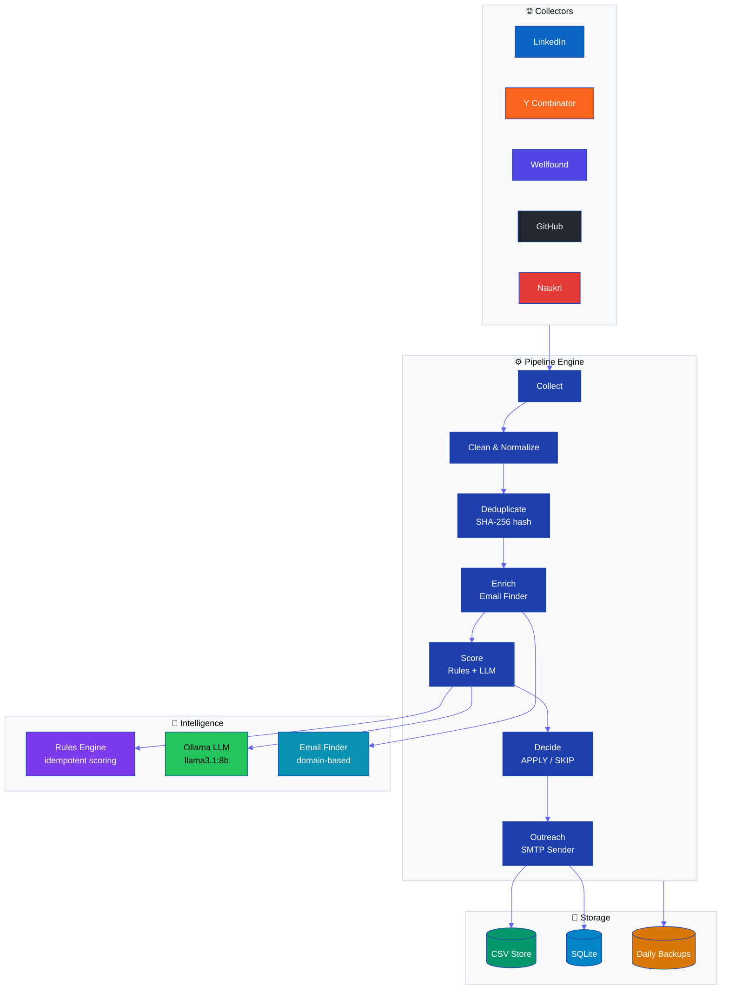
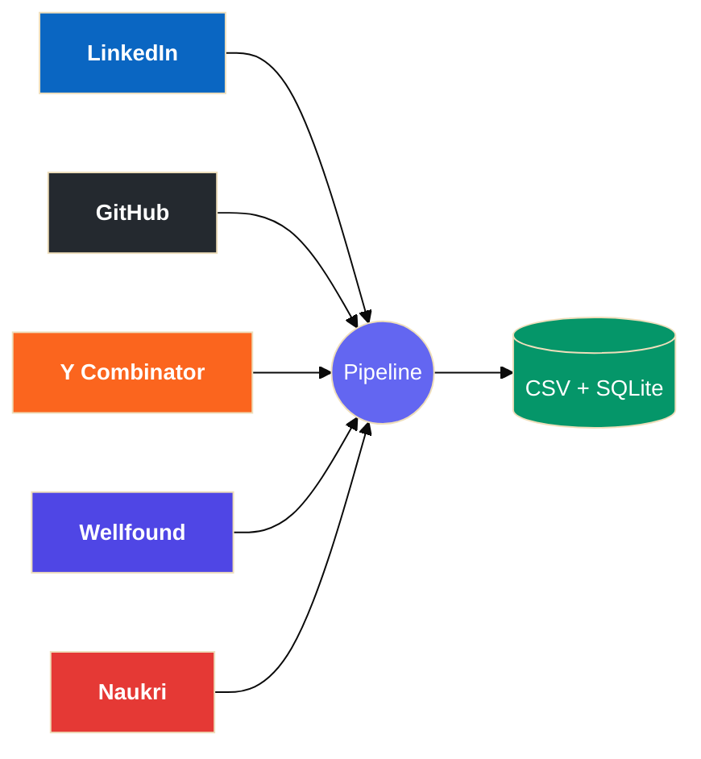
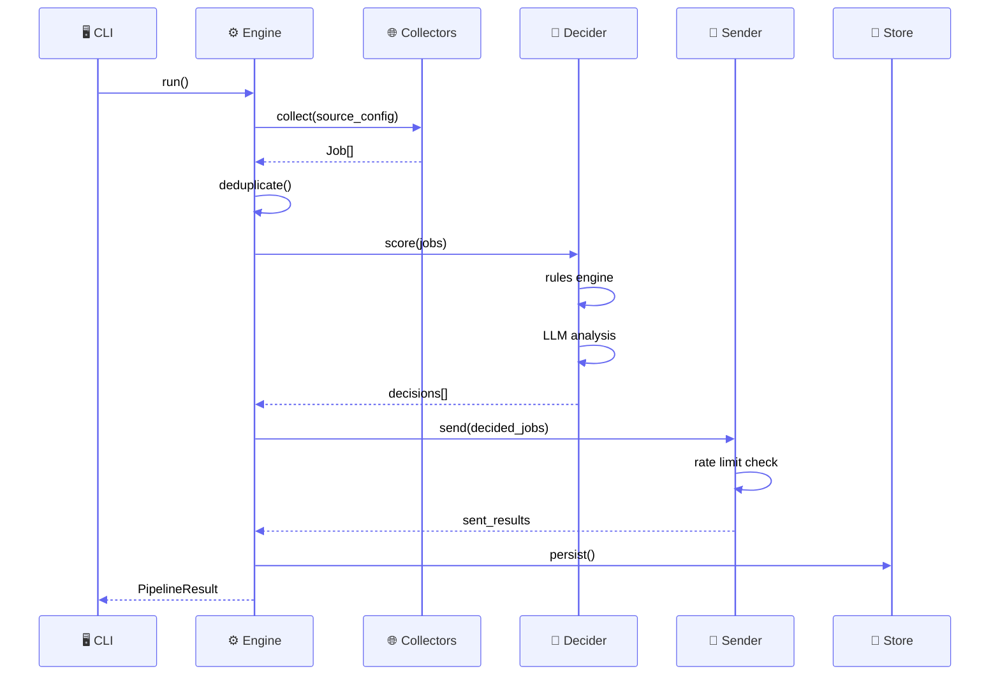
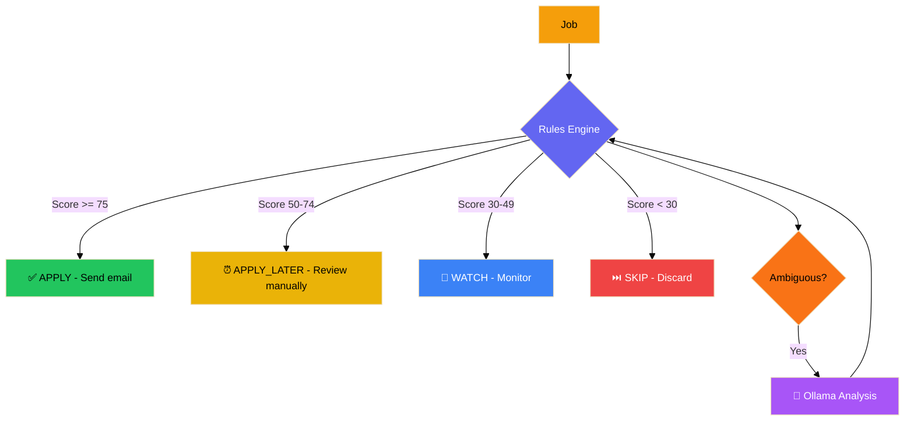
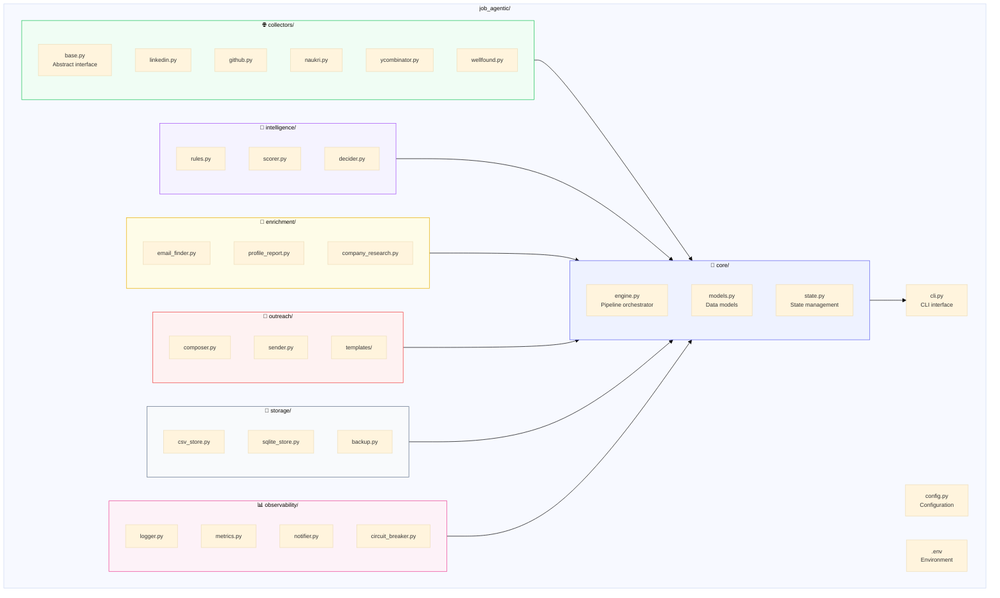
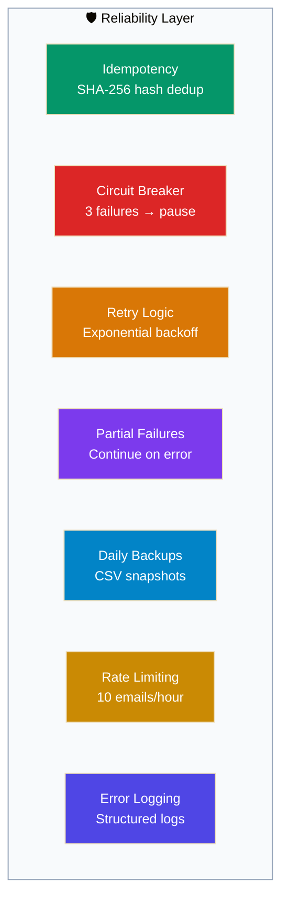
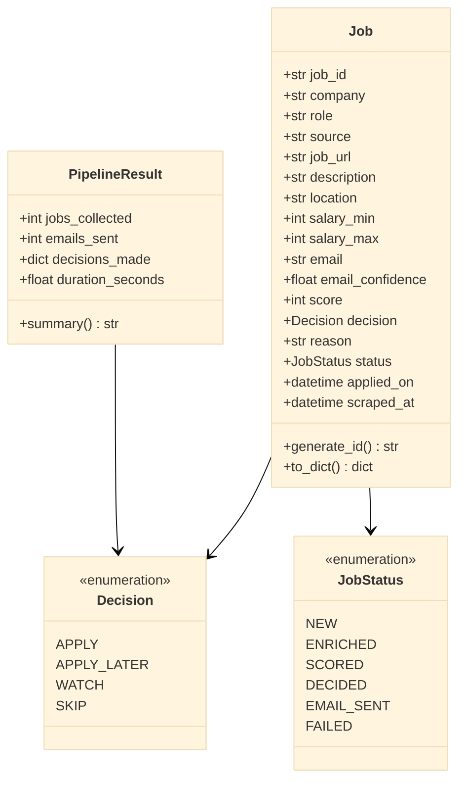

<p align="center">
  
</p>

<p align="center">
  <b>Production-grade autonomous job application automation — powered by local AI.</b>
</p>

<p align="center">
  <a href="https://youtu.be/DP0ZvabylzM"></a>
  <a href="https://python.org"></a>
  <a href="https://ollama.ai"></a>
  <a href="LICENSE"></a>
</p>

<p align="center">
  <b>⭐ Star this repo if you find it useful!</b>
</p>

<br>

<table align="center">
<tr>
<td width="65%" style="vertical-align:top;padding:20px">

### ✅ What It Is

**🤖 Fully Autonomous** — no UI, no manual intervention, runs on cron  
**⏰ Runs Unattended** — schedule daily/weekly via cron  
**🧠 AI-Powered Decisions** — APPLY / APPLY_LATER / WATCH / SKIP with reasoning  
**📧 Personalized Outreach** — auto-generates tailored emails per job  
**🛡️ Production-Grade** — survives failures, maintains state, audit logs  
**📊 Beautiful Terminal UI** — Rich progress bars, tables, analytics  

</td>
<td width="35%" style="vertical-align:top;padding:20px;background:#fef2f2;border-radius:12px">

### ❌ What It's NOT

Not an agent framework experiment  
Not a demo or prototype  
Not dependent on paid APIs (100% local LLM)  
Not a spam machine (intelligent filtering + rate limits)  

</td>
</tr>
</table>

---

## 📺 Demo

<p align="center">
  <a href="https://youtu.be/DP0ZvabylzM">
    
  </a>
  <br>
  <sub>👆 See live job collection from LinkedIn, GitHub, Naukri, YCombinator & Wellfound, AI scoring, and personalized email generation.</sub>
</p>

---

## 🔄 System Architecture



---

## 🏗️ Architecture Principles

<div style="display:flex;gap:12px;flex-wrap:wrap;margin:20px 0">

<div style="background:linear-gradient(135deg,#f0fdf4,#dcfce7);border:2px solid #22c55e;border-radius:16px;padding:20px;flex:1;min-width:200px;box-shadow:0 2px 8px rgba(34,197,94,0.15)">

**1️⃣ Rule-based first, LLM second**  
Fast deterministic logic before expensive inference.

</div>

<div style="background:linear-gradient(135deg,#eff6ff,#dbeafe);border:2px solid #3b82f6;border-radius:16px;padding:20px;flex:1;min-width:200px;box-shadow:0 2px 8px rgba(59,130,246,0.15)">

**2️⃣ Idempotent by design**  
Same input → same output, safe to re-run.

</div>

<div style="background:linear-gradient(135deg,#fef2f2,#fecaca);border:2px solid #ef4444;border-radius:16px;padding:20px;flex:1;min-width:200px;box-shadow:0 2px 8px rgba(239,68,68,0.15)">

**3️⃣ Fail gracefully**  
One broken source doesn't crash the pipeline.

</div>

<div style="background:linear-gradient(135deg,#fefce8,#fef08a);border:2px solid #eab308;border-radius:16px;padding:20px;flex:1;min-width:200px;box-shadow:0 2px 8px rgba(234,179,8,0.15)">

**4️⃣ Auditable**  
Every decision has a reason, every action logged.

</div>

<div style="background:linear-gradient(135deg,#f5f3ff,#ede9fe);border:2px solid #a855f7;border-radius:16px;padding:20px;flex:1;min-width:200px;box-shadow:0 2px 8px rgba(168,85,247,0.15)">

**5️⃣ Modular**  
Each component testable, replaceable, inspectable.

</div>

</div>

---

## 🛠️ Tech Stack

<table>
<thead>
<tr><th>Component</th><th>Technology</th><th>Purpose</th></tr>
</thead>
<tbody>
<tr><td><strong>Language</strong></td><td> Python 3.11+</td><td>Core runtime</td></tr>
<tr><td><strong>LLM</strong></td><td> llama3.1:8b</td><td>Local AI inference (zero API costs)</td></tr>
<tr><td><strong>Storage</strong></td><td>CSV + SQLite</td><td>Primary + queryable storage</td></tr>
<tr><td><strong>Scraping</strong></td><td><code>httpx</code>, <code>BeautifulSoup</code>, <code>Playwright</code></td><td>Job data collection</td></tr>
<tr><td><strong>Email</strong></td><td>SMTP (Gmail)</td><td>Automated outreach</td></tr>
<tr><td><strong>Terminal UI</strong></td><td> Rich</td><td>Beautiful CLI experience</td></tr>
<tr><td><strong>CLI</strong></td><td> Typer</td><td>Command-line interface</td></tr>
<tr><td><strong>Scheduler</strong></td><td>cron</td><td>Automated execution</td></tr>
</tbody>
</table>

---

## 🎯 Key Features

### Multi-Source Job Collection



| Source | Method | Rate Limit |
|--------|--------|------------|
| **LinkedIn** | HTTP scraper | 429 handling w/ retry |
| **GitHub** | REST API v3 | 60 req/hr (unauthed) / 5k req/hr (token) |
| **Naukri.com** | HTTP scraper | Configurable delay |
| **YCombinator** | HTTP scraper | Startup job board |
| **Wellfound** | HTTP scraper | AngelList startup platform |

### Pipeline Flow



### Intelligence Engine



### Scoring Breakdown

| Factor | Weight | Description |
|--------|--------|-------------|
| Experience Match | 30 pts | Years of experience vs requirement |
| Tech Stack | 20 pts | Python, React, FastAPI, etc. |
| Location | 15 pts | Remote, Bengaluru, SF, etc. |
| Company Stage | 10 pts | Seed / Series-A / Growth / Public |
| Recency | 15 pts | Posted within 7 days |
| Bonus | 10 pts | Known company, good culture signals |

---

## 📁 Directory Structure



---

## 🚀 Quick Start

<details open>
<summary><strong>▶ Step-by-step setup (click to expand)</strong></summary>

```bash
# 1. Clone
git clone https://github.com/fiscalmindset/job_agentic.git
cd job_agentic

# 2. Install Ollama + pull model
curl -fsSL https://ollama.com/install.sh | sh
ollama pull llama3.1:8b

# 3. Python deps
pip install -e .

# 4. Configure
cp .env.example .env
# Edit .env: SMTP, GitHub token, job preferences, enabled collectors

# 5. Dry run (no emails sent)
python3 cli.py run --dry-run

# 6. Live run
python3 cli.py run
```

</details>

---

## 💭 Philosophy

> **"This system should run for 6 months without human intervention,**
> **make intelligent decisions, and never embarrass you with spam."**

Built for reliability, not novelty. Production-ready, not prototype.

---

## 🧠 Decision Logic

### 1. Rule-Based Scoring (Fast ⚡)

```python
score = 0
+ 30  # Experience match (0-3 years)
+ 20  # Tech stack match (Python, React, FastAPI, etc)
+ 15  # Location match (Bengaluru, Remote, etc)
+ 10  # Company stage match
+ 15  # Posted recently (within 7 days)
= Total Score (0-100)
```

### 2. LLM Reasoning (When Needed 🤖)

- Ambiguous job descriptions → AI analysis
- Cultural fit assessment → Sentiment analysis
- Email personalization → Context-aware writing
- Profile matching → Deep skill comparison

### 3. Final Decision Tree

```
Score >= 75    → ✅ APPLY         (Send email immediately)
Score 50-74    → ⏰ APPLY_LATER   (Review manually first)
Score 30-49    → 👀 WATCH         (Monitor for changes)
Score < 30     → ⏭️ SKIP          (Not a good match)
```

---

## 🛡️ Reliability Features



| Feature | Implementation | Benefit |
|---------|---------------|---------|
| **Idempotency** | Job hash (SHA-256 of company+role+url) | No duplicate applications |
| **Circuit Breakers** | Pause failing sources after 3 errors | Prevent cascade failures |
| **Retry Logic** | Exponential backoff (1s, 2s, 4s, 8s) | Handle transient errors |
| **Partial Failures** | Continue pipeline if one step fails | Maximize job collection |
| **Daily Backups** | Automated CSV snapshots to `backups/` | Data loss prevention |
| **Rate Limiting** | Max 10 emails/hour (Gmail limits) | Avoid spam filters |
| **Error Logging** | Structured logs with traceback | Easy debugging |

---

## ⏰ Cron Automation

<table>
<tr>
<th>Schedule</th><th>Command</th><th>Purpose</th>
</tr>
<tr>
<td><code>0 9 * * *</code></td>
<td><code>python3 cli.py run</code></td>
<td>Daily job search (9 AM)</td>
</tr>
<tr>
<td><code>0 10 * * 0</code></td>
<td><code>python3 cli.py stats --last 7d</code></td>
<td>Weekly analytics (Sundays)</td>
</tr>
<tr>
<td><code>0 */6 * * *</code></td>
<td><code>python3 cli.py analyze-profile</code></td>
<td>Profile updates every 6h</td>
</tr>
</table>

---

## ✅ Production Checklist

<details>
<summary>Click to expand</summary>

- [ ] **Ollama Installed** — `ollama list` shows `llama3.1:8b`
- [ ] **Gmail App Password** — Created and added to `.env`
- [ ] **GitHub Token** — Personal access token for 5000 req/hr
- [ ] **Environment Variables** — `.env` file configured
- [ ] **Playwright Browser** — `playwright install chromium` (LinkedIn)
- [ ] **Test Run** — `python3 cli.py run --dry-run` (no errors)
- [ ] **Email Tested** — Verify emails reach inbox (not spam)
- [ ] **Cron Scheduled** — Automated daily execution
- [ ] **Log Rotation** — Prevent disk space issues
- [ ] **Backup Verified** — `backups/` directory accessible
- [ ] **Resume Uploaded** — `python3 cli.py upload-resume ./resume.pdf`

</details>

---

## 📊 Data Model



---

## 📈 Monitoring & Analytics

### Terminal Report (Auto-generated)

After each run, the system displays:

- **All Jobs Table** — Complete list with scores and decisions
- **Company Breakdown** — Top 15 hiring companies with percentages
- **Location Analysis** — Top 10 locations with visual distribution
- **Skills Demand** — Most/least in-demand technologies
- **Score Distribution** — Job quality (Excellent/Good/Fair/Poor)
- **Summary Stats** — Avg score, remote jobs, unique companies

### Key Metrics

```python
jobs_scraped_per_source     # Collection efficiency
decision_distribution       # APPLY/SKIP ratio
email_send_success_rate     # Outreach effectiveness
source_failure_rate         # Scraper health
pipeline_execution_time     # Performance monitoring
```

### Log Files

| File | Purpose |
|------|---------|
| `logs/jobctl.log` | Main application log |
| `logs/errors.log` | Error-only log |
| `logs/email_sent.log` | Outreach audit trail |

---

## 🔧 Configuration

<details>
<summary><strong>Environment Variables (.env)</strong></summary>

```bash
# SMTP Email Configuration
SMTP_HOST=smtp.gmail.com
SMTP_PORT=587
SMTP_USERNAME=your-email@gmail.com
SMTP_PASSWORD=your-app-password
EMAIL_FROM=your-email@gmail.com
EMAIL_FROM_NAME=Your Name

# GitHub API (for 5000 requests/hour)
GITHUB_TOKEN=ghp_your_personal_access_token

# Job Search Preferences
TARGET_ROLES=Software Engineer,Backend Engineer,AI Engineer
TARGET_LOCATIONS=Remote,Bengaluru,San Francisco
MIN_EXPERIENCE=0
MAX_EXPERIENCE=3
REQUIRED_SKILLS=Python,FastAPI,React,LangChain

# Enabled Collectors
ENABLED_COLLECTORS=linkedin,github,naukri,ycombinator,wellfound

# Profile Information
YOUR_NAME=Vicky Kumar
YOUR_GITHUB=https://github.com/fiscalmindset
YOUR_LINKEDIN=https://www.linkedin.com/in/algsoch/
YOUR_PORTFOLIO=https://ai-engineer-chatbot.onrender.com/
RESUME_PATH=./resume.pdf
```

</details>

---

## 🎨 Sample Output

<details>
<summary><strong>Click to view real pipeline output</strong></summary>

```
============================================================
🚀 Job Intelligence Operating System
============================================================
Mode: ✅ LIVE
Sources: all
============================================================

Deep Profile Intelligence...
  ✓ GitHub: 100 repositories analyzed
  ✓ AI Insights generated via Ollama (llama3.2:3b)
  ✓ Skills: Python, FastAPI, LangChain

============================================================
Pipeline Engine Starting
============================================================

linkedin: Collecting "AI Engineer" in "San Francisco"
  ✓ Page 1: 35 jobs
  ✓ Page 2: 60 jobs
  ⚠ Page 3: 429 — retry 1... succeeded
  ✓ Page 4: 35 jobs
  ✓ Page 5: 34 jobs
  ✓ Total: 204 jobs from LinkedIn

ycombinator: No jobs found
wellfound: 403 Forbidden — circuit breaker opened

Deduplication: 204 new jobs (0 duplicates)
Enrichment: Email discovered for 201/204 jobs (98.5%)
Scoring: 204 jobs scored

📊 Pipeline Results:
  • Jobs Collected: 204
  • After Dedup: 204
  • Enriched: 204 (201 with emails)
  • Scored: 204
  • Avg Score: 28.7
  • Duration: 26.8 seconds
  • Emails Sent: 0 (no jobs scored >= APPLY threshold)

🏢 Top Companies: Jack & Jill (74), Emonics LLC (9), Sieve (8)
📍 Top Location: San Francisco, CA (159)
📧 SMTP notification failed (BadCredentials — configure .env)

Backup created: data/backups/jobs_20260617_211947.csv
```

</details>

---

## 🌟 Acknowledgments

<p align="center">
  <a href="https://ollama.ai"></a>&nbsp;
  <a href="https://github.com/Textualize/rich"></a>&nbsp;
  <a href="https://playwright.dev"></a>&nbsp;
  <a href="https://typer.tiangolo.com"></a>
</p>

---

## 📜 License

MIT License — See [LICENSE](LICENSE) for details.

## 🤝 Contributing

See [CONTRIBUTING.md](CONTRIBUTING.md) for contribution guidelines.

## 📬 Contact

<table>
<tr><td><strong>📧 Email</strong></td><td><a href="mailto:npdimagine@gmail.com">npdimagine@gmail.com</a></td></tr>
<tr><td><strong>🐙 GitHub</strong></td><td><a href="https://github.com/fiscalmindset">@fiscalmindset</a></td></tr>
<tr><td><strong>💼 LinkedIn</strong></td><td><a href="https://www.linkedin.com/in/algsoch/">algsoch</a></td></tr>
<tr><td><strong>📖 Architecture</strong></td><td><a href="ARCHITECTURE.md">ARCHITECTURE.md</a> — deep dive into system internals</td></tr>
</table>

<p align="center">
  <picture>
    <source media="(prefers-color-scheme: dark)" srcset="https://github.com/fiscalmindset.png?size=40">
    
  </picture>
  <b>Made by <a href="https://github.com/fiscalmindset">fiscalmindset</a></b>
</p>